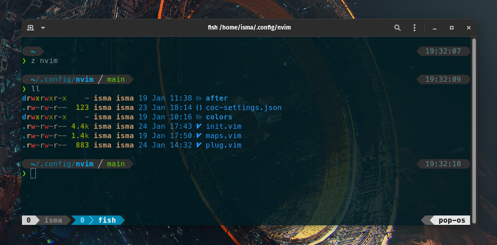

# My dotfiles



**Warning**: Don’t blindly use my settings unless you know what that entails. Use at your own risk!

## Contents

- vim (NeoVim) config
  - Plugins are managed with [vim-plug](https://github.com/junegunn/vim-plug)
- tmux config
- git config
- fish config

## Vim setup

Requires Neovim (>= 0.6)

- [vim-plug](https://github.com/junegunn/vim-plug) - A minimalist Vim plugin manager
- [coc.nvim](https://github.com/neoclide/coc.nvim) - Intellisense
- [nvim-autopairs](https://github.com/windwp/nvim-autopairs) - Autopairs for Neovim written by lua
- [nvim-treesitter](https://github.com/nvim-treesitter/nvim-treesitter) - Syntax highlighting
- [telescope.nvim](https://github.com/nvim-telescope/telescope.nvim) - A highly extendable fuzzy finder over lists
- [defx.nvim](https://github.com/Shougo/defx.nvim) - A file explorer

## Shell setup (Linux)

- [Fish shell](https://fishshell.com/)
- [Fisher](https://github.com/jorgebucaran/fisher) - Plugin manager
- [Tide](https://github.com/IlanCosman/tide) - Shell theme. Use version 5: `fisher install ilancosman/tide@v5`
- [Nerd fonts](https://github.com/ryanoasis/nerd-fonts) - Powerline-patched fonts. I use Meslo.
- [z for fish](https://github.com/jethrokuan/z) - Directory jumping
- [Exa](https://the.exa.website/) - `ls` replacement
- [ghq](https://github.com/x-motemen/ghq) - Local Git repository organizer
- [peco](https://github.com/peco/peco) - Interactive filtering

## How to install

You will need `git` and GNU `stow`

Clone into your `$HOME` directory or `~`

```bash
git clone https://github.com/ismateri/dotfiles-public.git ~/.dotfiles
```

Run `stow` to symlink everything or just select what you want

```bash
stow . # Everything
```

```bash
stow .tmux.conf # Just my tmux config
```

## That's it

Well, that's it, we're done.

